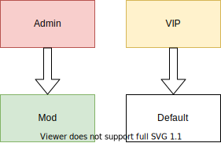

# LuckPerms
---
LuckPerms is probably the most feature-rich permissions plugin in existence currently. It supports many different kinds of servers, like Bukkit/Spigot or Sponge, but also all the major proxies like Velocity and Bungeecord.

### The Basics 
LuckPerms embraces many concepts like "Inheritance" or " Contexts" that might be confusing for a beginner. Consider this section a breakdown of those.
> [!INFO]
> For a more indepth explanation of the plugin, one might use the [official wiki](https://luckperms.net/wiki).
#### Permissions
A permission is simply put just a piece of text that plugins use to determine what a player can do. They are usually split by periods (like `minecraft.command.kick` for the vanilla /kick command). A permission can have 3 states: 
* `true`: the player can then use the feature which is associated to the permission
* `false` the player is explicitely revoked access to this command or feature.
* undefined: this permission has not been set for this group and defaults to either `true` or `false`, depending how the plugin which uses the permission has determined.
#### Groups
A group (or a "rank" as some prefer to call it) is a collection of permissions and other kinds of data which can be given to a player. This simplifies management of, lets say, the staff team as you can simply create a group `admin` and grant it `*` (this permission automatically allows access to everything) which can then be given to your admins and they will all have the same permissions. In this example it might seem counterintuitive, but for ranks with 100s of different permissions, it will become useful. 

One Group always exists: `default`. As its name implies, everybody is in this group, and it is used to give out permissions which every player should have.  
#### Inheritance
Inheritance is very useful to minimise repeated work. Let us consider the following example:
You have a group `VIP` and a group `MVP`. The group `VIP` is only used to **add** features on top of the `MVP` group. Yet by setting the users group to `MVP`, they would have the permissions from `VIP` revoked. This is where inheritance comes into play. You can make `MVP` inherit `VIP`, so every permission that is granted to `VIP` is automatically reflected in the permissions of `MVP`.
#### Contexts
Contexts define the cirumstances under which a permission or other data is applied. Still confused? 

Lets take the `gamemode` context as an example. Giving a permission to a player with the context `gamemode=creative` means that they player shall only have that permission if they are in gamemode creative. Quite simple, isn't it? Many plugins add their own contexts, such as EssentialsX' `vanished` pr `god`.  

---
### First Steps with LuckPerms

#### Storage

Your first step with LuckPerms will be choosing a storage solution. This is a very extensive topic, as each of the storage types come with their own advantages and disadvantages. 
A good writeup on this would be the [official article](https://luckperms.net/wiki/Storage-types) in the LuckPerms wiki. Essentially there are 3 types of storage:
* Flatfile (In-memory-databases, they work out-of-box)
* Text Files (Slower than flatfile, but editable and readable in plain text)
* Database (fastest, readable, but requires an external Database Server)

In case you run a multi-server setup (e.g. BungeeCord) your only option is a Database!

#### Your First Commands!
Once you have LuckPerms installed, you will notice that you do not have access to its primary command `/lp`. You could set it all up through your console, but for the sake of simplicity the command `lp user <your username> permission set * ` will give your player full access to every command to simplify the setup. 

Now that that's out of the way let's get started! 

Let's say we want the following architecture: 

This structure would allow us to use LuckPerms "promote" feature to, well, promote people. But for that to work, you have to setup "tracks" which the command should follow. Let's say for example you promote a `default` player. They should become a `VIP` and not an `Admin`!

First we have to create all those groups. Which is simple enough. It's just `/lp creategroup <Group Name>`!

LuckPerms has many features to edit in its groups and it might overwhelm you at the beginning. But really the only parts you need to know right now are `permission`, `parent`, `meta` and `setweight`. The rest are rather advanced or generally not needed. You already know how to add permissions, so go ahead, give out all the permissions you want your groups to have! In case you screw up somewhere, there always is `unset` to revoke it. 
In order to setup the inheritance/promote feature, you simply have to use the `parent` subcommand like this: `/lp group admin parent add mod` or generically `/lp group <higher group> parent add <lower group>`.  

That's the entire magic! Your setup is now working!

#### Prefixes and Rank Tags

LuckPerms does include the ability to set prefixes and suffixes in its `meta` submenu. But it does not apply them on its own! For that you need other plugins. A general plugin you will need is [Vault](https://dev.bukkit.org/projects/vault). For now don't worry about what Vault on its own does, just know that it's important!

 This intro will be split into 2 parts: Chat and Nametags (Tablist or above the playerhead).
##### Chat
There is no end to the list of chat formatting plugins. Most of them offer support to customize your chat format, and as such your prefixes too. It really depends on the specific plugin, but most ones will have a placeholder which you can include in the chat format. 
#### Tablist and Nametag
The entire story is a different one when we move to the Tablist part of this guide. There are only really 2 options:
* [NameTagEdit](https://www.spigotmc.org/resources/nametagedit.3836/)
* [TAB](https://github.com/NEZNAMY/TAB)

I will not go into extreme detail about the differences of the two plugins, as it should be rather obvious how they work. But, and this is vastly my personal experience, i found TAB to be a more pleasurable experience. Because, if you were to simply setup TAB to give everybody the LuckPerms Prefix Placeholder from PlaceholderAPI, it will just work with the data set in the `meta` submenu without having to edit any other plugins data.